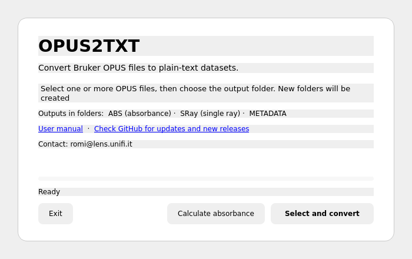

# opus2txt User Manual

**Current manual version: 1.1.1**

**Author:** Sebastiano Romi  
**Affiliation:** European Laboratory for non-Linear Spectroscopy (LENS), Università degli Studi di Firenze (UNIFI)  
**Contact:** [romi@lens.unifi.it](mailto:romi@lens.unifi.it)

## Purpose

`opus2txt` is a graphical utility for working with Bruker OPUS spectroscopy files. It provides two complementary workflows:

1. **Convert existing OPUS data to plain-text files.** Available absorbance, single-ray and metadata blocks are exported to simple tab-separated text datasets suitable for plotting, fitting, spreadsheets or scientific-analysis software.
2. **Calculate absorbance from sample and background spectra.** If compatible sample and background single-ray spectra are available, `opus2txt` calculates absorbance and exports the result together with the sample single-ray trace and metadata.

This manual is available both as [`MANUAL.md`](MANUAL.md) and as [`MANUAL.pdf`](MANUAL.pdf). The PDF copy is regenerated automatically whenever the Markdown manual is updated.

## Graphical interface



The current interface is implemented with PySide6/Qt and follows the desktop theme supplied by the operating system. The main window provides:

- **Select and convert** for extracting existing OPUS data blocks;
- **Calculate absorbance** for sample/background processing;
- a progress bar and status display;
- direct links to the user manual and GitHub repository/update page;
- the author contact address;
- an **Exit** button.

The application remembers the directory containing the most recently processed OPUS input file. On first use, or when the saved directory is no longer valid, file selection starts from the user's home directory.

## Download and start the application

Pre-built desktop applications are available from the [latest GitHub Release](https://github.com/SebRoLENS/opus2txt/releases/latest). These packages include the required runtime and dependencies, so Python, PySide6, and `brukeropus` do not need to be installed separately.

Available packages:

- **[Linux x86_64 — AppImage](https://github.com/SebRoLENS/opus2txt/releases/latest)**
- **[Windows x86_64 — standalone `.exe`](https://github.com/SebRoLENS/opus2txt/releases/latest)**
- **[macOS Apple Silicon — `.dmg`](https://github.com/SebRoLENS/opus2txt/releases/latest)**
- **[macOS Intel — `.dmg`](https://github.com/SebRoLENS/opus2txt/releases/latest)**

Older versions remain available from the [complete GitHub Releases archive](https://github.com/SebRoLENS/opus2txt/releases).

### Linux

Download the AppImage corresponding to the current release. If required by the desktop environment, mark the file as executable in its file properties, then open it normally.

The Linux AppImage is cryptographically attested through the project's GitHub Actions build process.

### Windows

Download the `.exe` file and open it normally. No installation is required.

The Windows build is currently unsigned, so Windows may display a security warning when the application is opened for the first time.

### macOS

Download the `.dmg` matching the Mac architecture:

- `arm64` for Apple Silicon Macs;
- `x86_64` for Intel Macs.

Open the DMG and launch `opus2txt`. The macOS builds are currently unsigned, so macOS may display a security warning when the application is opened for the first time.

## Accepted OPUS files

`opus2txt` accepts files whose **final extension consists entirely of digits**, for example:

```text
sample.0
sample.1
sample.4
sample.12
sample.123
```

Files with non-numeric extensions are ignored. Hidden files and paths containing hidden components (directory or file names beginning with `.`) are rejected.

This filtering is intentional because Bruker OPUS datasets commonly use numeric filename extensions.

# Workflow 1 — Select and convert

Use this workflow when the OPUS file already contains the data blocks you want to export.

## 1. Select OPUS files

Press **Select and convert**. The system file-selection dialog opens immediately.

Select one or more accepted Bruker OPUS files. If some selected files are hidden or do not have a numeric extension, the application reports that they were ignored and continues with the valid files.

## 2. Select the output folder

After the OPUS files have been selected, the application opens the output-folder dialog. It initially points to the directory containing the first selected input file.

Choose the directory where the converted files should be written.

## 3. Generated files

For each selected OPUS file, `opus2txt` creates up to three output types.

### ABS

If the OPUS file contains an absorbance block (`a`), data are written to:

```text
ABS/<original_name>_ABS.txt
```

with columns:

```text
wavenumber    absorbance
```

### SRay

If the OPUS file contains a single-ray block (`sm`), data are written to:

```text
SRay/<original_name>_SRay.txt
```

with columns:

```text
wavenumber    transmittance
```

### METADATA

Parameters printed by `brukeropus` are written to:

```text
METADATA/<original_name>_META.txt
```

The `ABS`, `SRay`, and `METADATA` directories are created automatically inside the selected output directory and existing directories are reused.

## 4. Progress and errors

The main-window progress bar advances as the selected files are processed. If one OPUS file cannot be read or converted, an error dialog identifies the file; the remaining selected files continue to be processed.

After successful processing, the directory containing the input file is stored as the starting location for the next run.

# Workflow 2 — Calculate absorbance

Use this workflow when the sample absorbance is not already available and you have a compatible background measurement.

## 1. Open the absorbance dialog

Press **Calculate absorbance**. A dedicated dialog opens with separate controls for the sample spectra and background file.

## 2. Select sample OPUS spectra

Press **Select OPUS spectra** and select one or more sample files. The same numeric-extension and hidden-file checks used by the conversion workflow are applied.

The dialog reports how many sample files have been selected.

## 3. Select the background OPUS file

Press **Select background file** and choose one background OPUS file.

The background must also be an accepted numeric-extension OPUS file and must contain the required single-ray data if absorbance is to be calculated from sample/background intensities.

## 4. Calculate and select the output folder

Press **Calculate**. The application then asks for the output folder and processes every selected sample against the same background spectrum.

The progress bar and status text are updated while the samples are processed.

## 5. Absorbance equation

When both the sample and background contain single-ray (`sm`) data, absorbance is calculated point by point as

$$
A = -\log_{10}\left(\frac{S_{sample}}{S_{background}}\right)
  = \log_{10}\left(\frac{S_{background}}{S_{sample}}\right).
$$

The calculated spectrum is written to:

```text
ABS/<sample_name>_ABS.txt
```

with columns:

```text
wavenumber    absorbance
```

The sample single-ray spectrum is also written to `SRay/` when available, and the sample metadata are written to `METADATA/`.

### Important compatibility note

The sample and background should originate from compatible measurements and should use the **same spectral grid**. The current implementation pairs the sample and background single-ray arrays point by point; it does not interpolate one spectrum onto the grid of the other.

Only points for which both sample and background intensities are positive are evaluated with the logarithmic expression. Non-positive intensity pairs are written as zero absorbance.

### Fallback to existing absorbance

If the single-ray data required for a sample/background calculation are unavailable but the sample file already contains an absorbance block (`a`), `opus2txt` exports that existing absorbance block instead.

If neither a valid sample/background single-ray calculation nor a pre-calculated sample absorbance is available, an error is reported for that sample and processing continues with the remaining selected files.

## Existing output directories

The `ABS`, `SRay`, and `METADATA` directories are created automatically when needed. Existing directories are reused; therefore output from multiple compatible processing runs can be directed to the same parent directory if desired.

## Remembered input directory

The current Qt interface stores the most recently used OPUS input directory through `QSettings`. If an older version of `opus2txt` stored the same preference in its legacy JSON configuration file, the application attempts to migrate that setting automatically.

Saved paths that no longer exist or contain hidden path components are ignored and the application falls back to the user's home directory.

## Manual and update links

The main window contains clickable links to:

- this user manual;
- the GitHub repository, where current releases and updates are published.

If the operating system cannot open a link automatically, the application displays the explicit URL so that it can be copied into a browser.

The contact address `romi@lens.unifi.it` is also shown in the graphical interface and when the program is launched from a terminal.

## Running from source

Running from source is optional and intended for users who want to inspect, modify, or develop the program.

### Dependencies

```text
Python >= 3.10
PySide6
brukeropus
```

### Virtual environment

Using a dedicated virtual environment:

```bash
python3 -m venv ~/.venv/opus2txt
~/.venv/opus2txt/bin/python -m pip install PySide6 brukeropus
~/.venv/opus2txt/bin/python opus2txt.py
```

### pipx

The script contains PEP 723 dependency metadata. With a recent version of `pipx`:

```bash
pipx run ./opus2txt.py
```

## Platform support

The graphical interface uses PySide6/Qt. Qt requests the native platform file dialog when available, allowing integration with Linux desktop environments and the normal system dialogs on Windows and macOS.

## Citation

For scientific use, please cite the archived Zenodo release corresponding to the version used. See the Citation section of the README and `CITATION.cff`.
